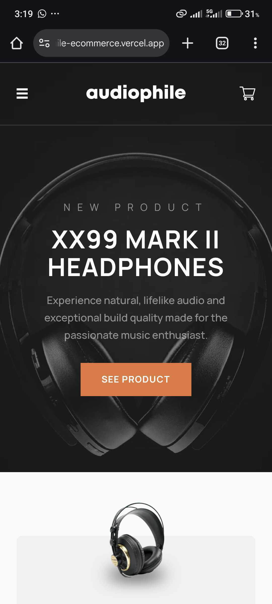
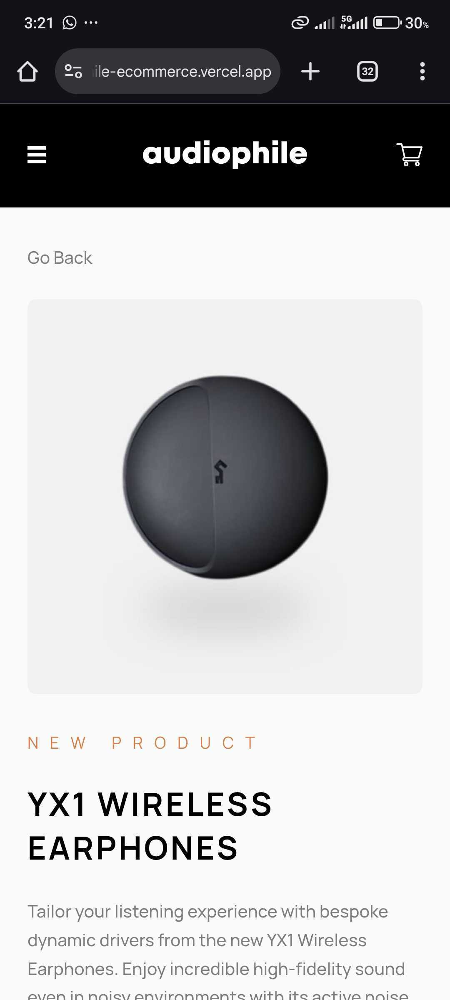
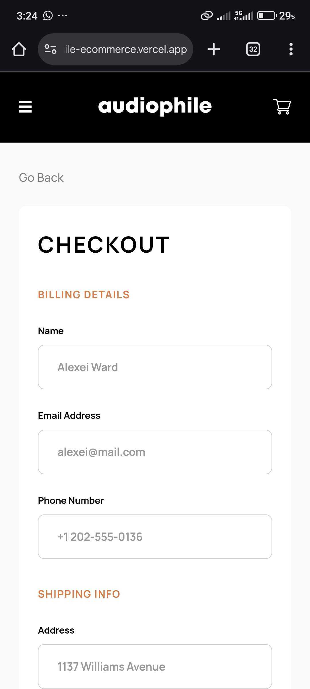
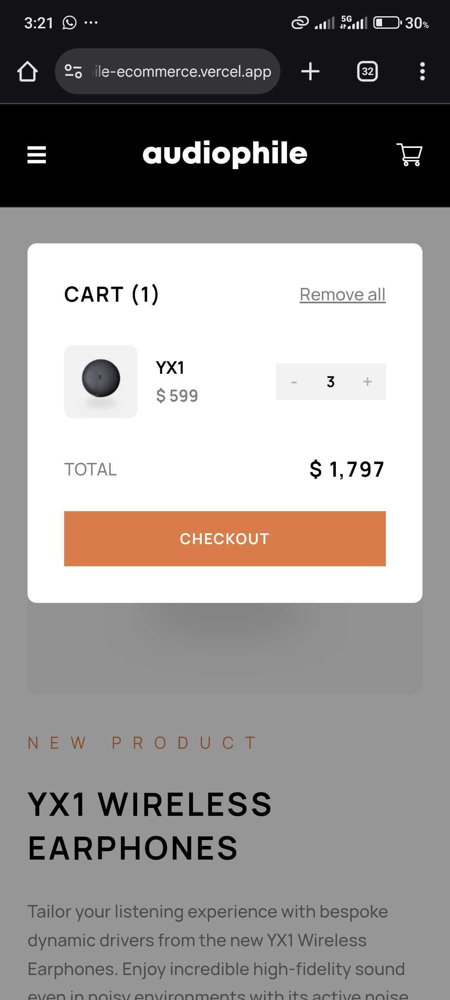

# C3Techie-Audiophile Ecommerce

## Project Preview

### Desktop

<p align="center">
  
  
  
  
  
</p>

### Mobile

<p align="center">
  
  
  
  
  
</p>

## Stage 3a Task Resources

- **Figma (Pixel-perfect source of truth):**
  [Audiophile E-commerce Website](https://www.figma.com/design/jfDxXzGw2lfyJOgFGbJOW4/audiophile-ecommerce-website?node-id=0-1&p=f)

- **Study Material:**
  - [React Official Docs](https://react.dev/)
  - [Next.js Docs](https://nextjs.org/docs)
  - [Convex Backend Docs](https://docs.convex.dev/)
  - [Forms & Validation in React](https://react.dev/learn/forms)
  - [Responsive Layouts (CSS-Tricks)](https://css-tricks.com/snippets/css/media-queries-for-standard-devices/)
  - Sending Emails:
    - [Resend API](https://resend.com/)
    - [Nodemailer](https://nodemailer.com/about/)

## Stage 3a Acceptance Criteria & Submission Checklist

- Pixel-perfect build: Matches Figma across all screen sizes
- Checkout works end-to-end: Orders saved in Convex, confirmation email sent
- Validation & edge cases handled: All error states clearly surfaced
- Order confirmation page: Displays full order summary
- Email template: Responsive, personalized, and successfully delivered
- Accessibility: Forms, navigation, and errors must be screen-reader friendly
- Code quality: Clean, modular, and well-documented

- **Submission:**
  - Live deployed app link
  - GitHub repo with code + setup instructions
  - Example confirmation email template (HTML)

A pixel-perfect, full-stack e-commerce site built with Next.js, Convex, and Resend for the HNG Internship Stage 3a Frontend Task.

## Features
- Pixel-perfect implementation of the Audiophile Figma design
- Responsive across mobile, tablet, and desktop
- Accessible forms and navigation
- Functional checkout with validation and edge case handling
- Orders stored in Convex backend
- Transactional confirmation email sent via Resend
- Order confirmation modal with summary

## Tech Stack
- Next.js 13+ (App Router, TypeScript)
- Tailwind CSS
- Convex (backend/database)
- Resend (email API)
- React Hook Form + Zod (form validation)

## Getting Started

### 1. Clone the repo
```bash
git clone https://github.com/C3Techie/c3techie-audiophile-ecommerce.git
cd c3techie-audiophile-ecommerce
```

### 2. Install dependencies
```bash
npm install
```

### 3. Configure environment variables
Create a `.env.local` file:
```env
NEXT_PUBLIC_CONVEX_URL=your_convex_url
CONVEX_DEPLOYMENT=your_convex_deployment
RESEND_API_KEY=your_resend_api_key
```

- Get Convex URLs by running `npx convex dev` and following prompts
- Get Resend API key from https://resend.com

### 4. Start the dev server
```bash
npm run dev
```

## Deployment

### Vercel (Recommended)

Live deployed app: [https://c3-techie-audiophile-ecommerce.vercel.app/](https://c3-techie-audiophile-ecommerce.vercel.app/)

1. Push your code to GitHub
2. Go to [vercel.com](https://vercel.com/) and import your repo
3. Add your environment variables in the Vercel dashboard
4. Deploy!

### Netlify
- Also supported, but Vercel is preferred for Next.js

## Environment Variables
- `.env.local` should NOT be committed to git
- Add these in your deployment dashboard (Vercel/Netlify)

## Example Confirmation Email Template
The confirmation email includes:
- Greeting with user’s name
- Order ID
- Order summary (items, prices, quantities)
- Shipping details
- Support contact info
- Responsive, branded HTML

```html
<!-- Example snippet from the email template -->
<h2>Thank you for your order, Alexei!</h2>
<p>Order ID: clx1234567890</p>
<ul>
  <li>XX99 Mark II Headphones x1 - $2999</li>
  <li>YX1 Earphones x2 - $599</li>
</ul>
<p><strong>Grand Total: $4197</strong></p>
<p>Shipping to: 1137 Williams Avenue, New York, 10001, United States</p>
<a href="https://your-deployed-app.com/orders/clx1234567890">View your order</a>
```


---

**Note:** If you do not see the confirmation email in your inbox, please check your spam folder. Some email providers may mark transactional emails as spam until you whitelist the sender or mark it as not spam.

